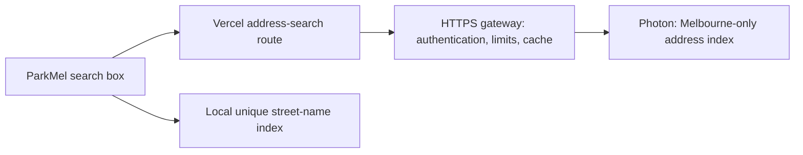

# ParkMel: self-hosted address search before semi-public launch

Prepared 8 October 2026. Status: researched deployment plan; no server has been purchased, started or configured. Capacity figures below are proposed targets, not measured results.

ParkMel should switch all numbered-address lookups to its own Photon service before opening the pilot to people beyond the current small test group. Do not wait for a warning or ban: Photon publishes no numerical safe traffic allowance for its demo service. Self-hosting removes this dependency, while uptime becomes our responsibility. [Photon policy and installation](https://github.com/komoot/photon#demo-server)

## Recommended first setup

Keep the website on Vercel and parking records in Supabase. Run Photon on one Linux VPS, with a custom metropolitan Melbourne database from the first launch. Address queries remain limited to metropolitan Melbourne. This city index gives long roads their numbered-address locations without expanding the parking annotation area.

Use Java 21 or later and a pinned stable Photon release with its embedded search database. Avoid adding a separate distributed search cluster for the first launch. Confirm the release and database versions match before installation. [Photon installation](https://github.com/komoot/photon#installation), [embedded mode](https://github.com/komoot/photon/blob/master/docs/usage.md#configuring-the-photon-database)

Use GraphHopper's Australia–Oceania Photon JSON dump as build input, then filter it before import. Do not install the complete regional database on the production serving machine. The catalogue currently lists a compatible JSON dump of about 714 MB compressed; that describes the source download, not the final Melbourne index. Pin a dated source and a compatible stable Photon release. [Source dumps](https://download1.graphhopper.com/public/australia-oceania/index.html)

### Melbourne boundary and import

1. Use the ABS 2026 **Greater Melbourne GCCSA** polygon as the initial reproducible definition of metropolitan Melbourne. Inspect the boundary on a map before freezing it: this statistical area includes outer metropolitan land, and a later product boundary may be narrower. Record the polygon source, edition, licence and checksum. Transform its published coordinates to WGS84 before comparing with Photon coordinates. [ABS boundary downloads](https://www.abs.gov.au/statistics/standards/australian-statistical-geography-standard-asgs/edition-4-july-2026-june-2031/access-and-downloads/digital-boundary-files)
2. Inspect the JSON dump specification and stream records through a deterministic spatial filter. Keep Australian address, road and place records inside the polygon. Preserve address/suburb/state/country fields. Retain only any additional locality context required for edge addresses; a proposed 2 km context buffer must not make addresses outside the metropolitan polygon searchable.
3. Import the filtered records into a **new empty** Photon data directory, using the chosen release's documented import command. Record source date, boundary version, input/retained/rejected counts, filter version and resulting index size. Photon explicitly supports preprocessing JSON dumps before import. [Import documentation](https://github.com/komoot/photon/blob/master/docs/usage.md#importing-data)
4. Add a polygon check to the server result validation so only metropolitan results reach the user. Derive the upstream query bounding box from this same polygon; the app's current hard-coded rectangular bounds are a temporary search filter, not the definition of metropolitan Melbourne.
5. Test core suburbs and boundary addresses, plus Sydney, Geelong and other deliberately out-of-area examples. Preserve long-road addresses inside Melbourne and verify that unrelated locations are excluded.

The filter/import script and boundary artifact are required deliverables before server purchase. Do not delete individual documents from a live search-engine index to create the extract. Build and test an independent replacement. The final index should be smaller than the complete regional index, but memory and storage savings must be measured.

Capacity benchmark starting point: 2 vCPU, 4 GB RAM, 80 GB SSD. Test a Java heap around 2 GB while leaving memory for the OS and file cache. Move to 8 GB RAM if testing shows memory pressure, swapping or unacceptable latency. Reserve space for the live index, a replacement index, archives and logs; measure the unpacked index before accepting the disk size. These settings are our initial engineering assumptions, not an upstream minimum or performance promise. Test a smaller plan after the Melbourne index exists; buy only the smallest plan that passes the capacity checks.

Choose a region near Melbourne where possible, and test the full path from the Vercel deployment to the VPS. The build/import machine may need more memory than the serving machine. Build the Melbourne index locally or on temporary capacity, then transfer the tested index to the serving VPS.

## Budget to approve when launch approaches

A current DigitalOcean Basic price reference is US$24/month for 4 GB RAM, 2 vCPU and 80 GB SSD, or US$48/month for 8 GB RAM, 4 vCPU and 160 GB SSD. Weekly percentage-based backups add 20%, making those examples US$28.80 or US$57.60/month. These are comparison prices, not a provider selection, minimum required budget or a purchased service. Melbourne-only measurements may justify a cheaper plan; no reduced cost is promised before benchmarking. [Official pricing](https://www.digitalocean.com/pricing/droplets)

Allow separately for taxes, AUD conversion, a hostname/domain if needed, additional storage or transfer, and any temporary staging server. Recheck actual region availability and the checkout total before purchase. Start with a monthly cap the owner accepts; do not enable automatic capacity upgrades.

## Request flow

The browser should call a new same-origin `/api/address-search` route. The current `/api/search` route serves an older protected precinct-search contract; keep that contract separate. A server-only `PHOTON_BASE_URL` selects our service, with a server-only gateway credential. Neither the credential nor raw infrastructure URL belongs in browser code.

The HTTPS gateway accepts only authenticated ParkMel server requests. Keep Photon/search-engine ports private and expose only the needed gateway endpoint. TLS protects the connection. Browser CORS settings are not an authentication mechanism. The current guest/address-search behavior can remain available with a small guest quota; signing in remains required for zoom and annotations.

Keep explicit Search/Enter submission, query length limits, exact house-number validation, Melbourne polygon validation, five-result maximum and browser cancellation. Enforce the query bounds and provider choice again on the server; never accept an arbitrary upstream URL from users. Add a bounded shared cache and abuse limits that work across Vercel instances, rather than relying on per-function memory.

Proposed starting limits to tune during testing: 10 address lookups per minute per guest identity/IP, 30 per minute per verified account, and a global gateway ceiling of 5 uncached lookups per second. Derive identities from verified server information; do not trust a client-supplied user ID or forwarding header. Return 429 with Retry-After when limited. Cache successful normalized queries for 24 hours and empty results for 5 minutes; do not cache service failures as missing addresses. Use a bounded cache on the VPS or another shared store, with its cost included in the launch budget.

Keep account tokens and email addresses out of upstream requests. Avoid logging raw address queries by default. Record aggregate latency, errors, rate-limit counts and cache hits, with short retention for diagnostic logs.

## Sequence and completion checks

| Step | Work | Completion check |
| --- | --- | --- |
| 1. Prepare the app | Replace the hard-coded demo URL with the server route and configurable upstream; add timeout, shared limits, cache and feature switch. | Automated tests cover successful lookup, unknown address, provider failure, cancellation, rate limiting and empty configuration. |
| 2. Build locally | Pin the Greater Melbourne polygon and compatible JSON source; implement the streaming spatial filter; import the retained data into a fresh index. Record checksums, record counts, dates and versions. | Search works without the public demo; out-of-area addresses are excluded. Record index disk use, memory and startup time; compare smaller VPS capacities. |
| 3. Provision staging | Create the approved VPS; configure non-root service, persistent storage, restart on boot, firewall, authenticated HTTPS gateway and backups. | Reboot recovery works; direct unauthenticated gateway requests fail; internal database/admin ports are inaccessible. |
| 4. Verify address quality | Check at least 30 independently reviewed Melbourne addresses, including numbered addresses, several sections of long roads, suburbs, suffixes, unit formats and metropolitan boundary cases. | Returned locations match reviewed sources; missing numbers never silently resolve to the road midpoint. Document unsupported formats instead of guessing. |
| 5. Verify capacity and failures | Test our staging service only, including cache misses, bursts, provider restart and network timeout. | Target p95 under 2 seconds at 2 uncached searches/second for 15 minutes, under 1% server errors, no swapping/OOM; overload receives controlled 429 responses. Resize or lower quotas if targets fail. |
| 6. Switch Vercel | Set the production server URL/credential, deploy, enable address lookup, then verify from desktop and phone. | Browser and server traffic contains zero requests to photon.komoot.io. Successful and failed address lookups leave street-name search available. |
| 7. Open the pilot | Complete a 48-hour small-group soak and check billing and alerts. | No unexplained restarts, memory pressure or error spikes; owner knows how to disable address search and restore the previous index. |

Before opening invitations, verify the app contains no production demo fallback. If our service is down, show the retry message and retain local road-name search. Rollback means restoring our last known-good service/index or temporarily disabling address lookup; it does not mean returning semi-public traffic to the demo API.

## Data updates and recovery

Start with a weekly check for a newer published source dump and a monthly planned rebuild of the Melbourne extract using the same versioned polygon/filter. If no newer usable extract exists, keep the healthy index and report its age; do not claim the data updated. Keep the source timestamp distinct from the download date.

Build or unpack each Melbourne-only replacement into a separate versioned directory, check disk space, start it on a private staging port and run the address sample. Switch the gateway to the tested instance, observe it, then retain the previous index for rollback. Only remove old files after the replacement is accepted. Photon documents safe database replacement and the need for room for both versions. [Update procedure](https://github.com/komoot/photon#updating-photon-with-a-new-version-of-the-database-dump)

The index is reproducible public data. Back up the service/gateway configuration, version manifest and any non-reproducible operational state; retain a known-good archive or stopped index snapshot. Test recovery onto a fresh instance, including secrets from their secure store. Treat a single-server deployment as having possible maintenance downtime.

Melbourne filtering is the default implementation, rather than a later optimisation. Keep the unfiltered regional source only on the build machine while needed, and remove it according to a documented retention policy after a successful reproducible build. A query bounding box alone does not shrink a database. Maintain the polygon/filter pipeline for every update so a full regional index is never substituted accidentally.

Keep visible OpenStreetMap attribution and record the data source and licence with the release manifest. [Regional data attribution](https://download1.graphhopper.com/public/australia-oceania/index.html)

## What the owner needs to do

1. Decide the approximate launch date and monthly hosting cap; approve the actual plan and price when capacity testing is complete.
2. Create the hosting account and add its payment method. Share access through the provider's supported collaboration flow rather than pasting credentials into chat.
3. Choose an HTTPS hostname: use a suitable provider-managed hostname, or register a domain and grant DNS access. A custom domain is optional if the provider supplies a usable HTTPS endpoint.
4. Choose who receives outage and billing alerts, and confirm that the short maintenance downtime of a single-server pilot is acceptable.

Everything else—local prototype, capacity measurements, configuration, app integration, tests and a concrete launch checklist—can be prepared before server purchase. Buying a server, configuring DNS and changing production traffic are subsequent execution tasks. This document creates no scheduled task or recurring automation.

## Trackable launch tasks

- [ ] P1: Implement the same-origin configurable address-search route and shared limits/cache.
- [ ] P2: Build and verify the Melbourne polygon/filter/import pipeline; measure the city-only index and document the minimum working VPS size.
- [ ] P3: Obtain hosting budget/account/HTTPS endpoint decisions.
- [ ] P4: Provision and harden the approved staging service; test backups and reboot.
- [ ] P5: Pass address-quality, capacity, failure and browser tests.
- [ ] P6: Switch production, verify no demo traffic and complete the small-group soak.
- [ ] P7: Open semi-public invitations; assign update and incident ownership.
